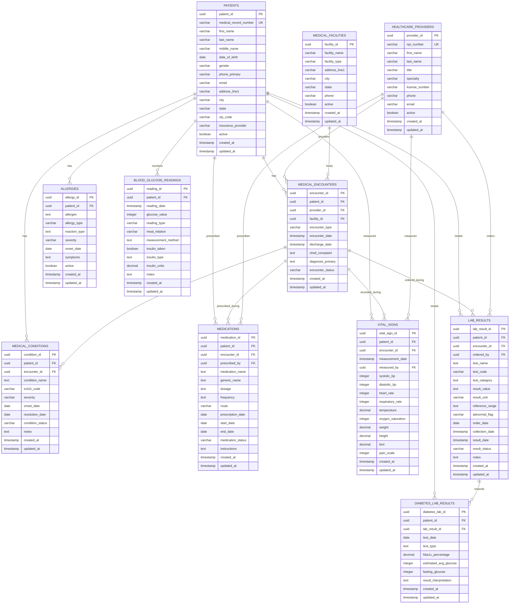

# Medview Connect - Simplified ER Diagram

## Core Medical Data Model
This simplified ER diagram shows the essential tables for patient management and clinical data.

## Key Tables Overview

### Core Tables (4)
- **PATIENTS**: Patient demographics and contact information
- **HEALTHCARE_PROVIDERS**: Doctors, nurses, and medical staff
- **MEDICAL_FACILITIES**: Hospitals, clinics, and medical centers
- **MEDICAL_ENCOUNTERS**: Patient visits and appointments

### Clinical Data Tables (5)
- **MEDICAL_CONDITIONS**: Diagnoses and medical conditions
- **MEDICATIONS**: Prescriptions and medication history
- **ALLERGIES**: Patient allergies and adverse reactions
- **VITAL_SIGNS**: Blood pressure, heart rate, weight, etc.
- **LAB_RESULTS**: Laboratory test results

### Essential Diabetes Tables (2)
- **BLOOD_GLUCOSE_READINGS**: Blood sugar monitoring
- **DIABETES_LAB_RESULTS**: HbA1c and diabetes-specific lab tests

## Key Relationships
- All clinical data is linked to **PATIENTS**
- **MEDICAL_ENCOUNTERS** connect patients with providers and facilities
- Clinical data can be associated with specific encounters
- Diabetes-specific tables extend the core clinical data model

This simplified model focuses on the essential patient care and clinical data management capabilities.